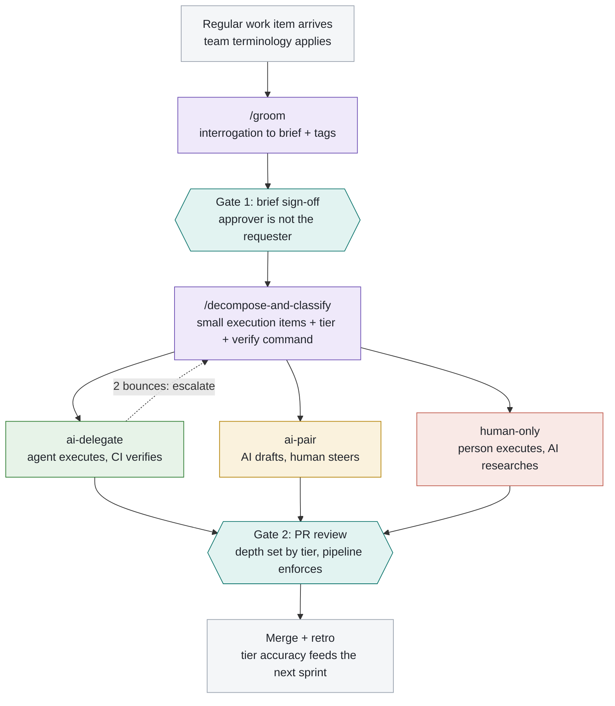
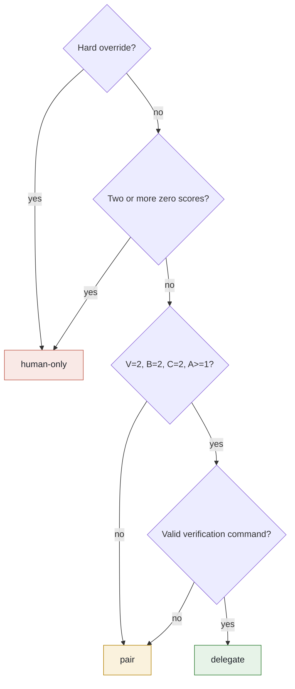
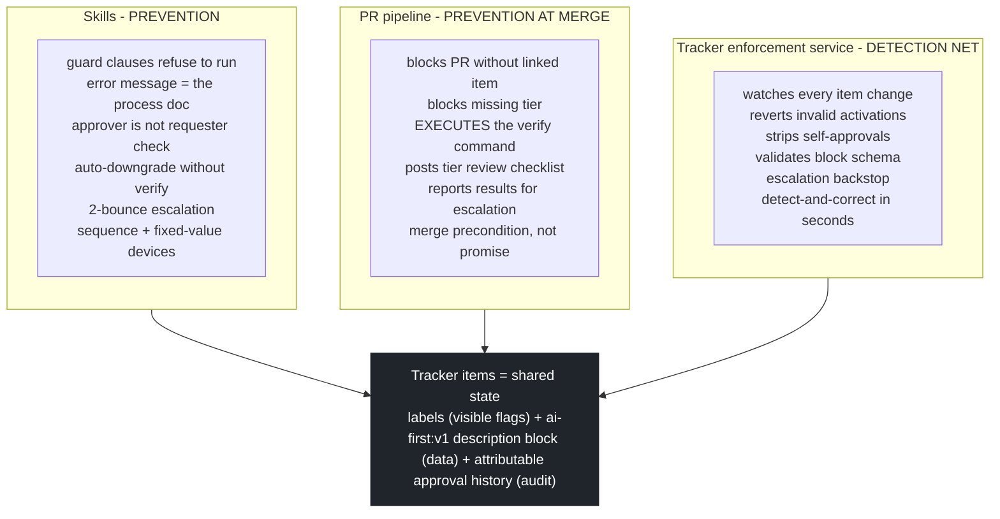
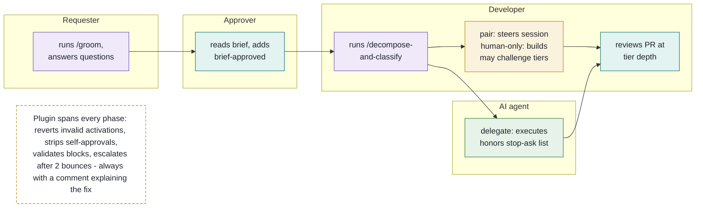

# AI-First Delivery

**A mistake-proofed workflow for software teams: groom, classify, delegate, verify**

> Version 1.2 draft | September 2026
> Reference implementation: tracker-neutral schema with Azure DevOps, GitHub Issues, and Linear adapters; Agent Skills for GitHub Copilot, Claude Code, and Codex
> Companion artifacts: `ai-first-schema.md`, `ai-first-capabilities.yml`, `/groom`, `/decompose-and-classify`, plugin workflow spec

**Abstract.** Most teams govern AI-assisted development with policy documents that nobody reads at the moment a mistake is being made. This paper describes a different approach: a delivery workflow in which the expensive mistakes are made structurally impossible or immediately visible, borrowing the poka-yoke (mistake-proofing) discipline from the Toyota Production System. Work items are groomed by an interrogation skill, decomposed into atomic execution items, and classified into three delegation tiers by four measurable signals. Enforcement lives in three layers (skill guard clauses, a PR verification pipeline, and a tracker-agnostic enforcement service) rather than in a wiki. The result is a system a whole team can follow without memorizing it, because the system corrects them faster than they can drift.

---

## Contents

1. [Why process documents fail AI-assisted teams](#1-why-process-documents-fail-ai-assisted-teams)
2. [The framework at a glance](#2-the-framework-at-a-glance)
3. [The delegation classifier](#3-the-delegation-classifier)
4. [Mistake-proofing: the enforcement architecture](#4-mistake-proofing-the-enforcement-architecture)
5. [The team-applied workflow](#5-the-team-applied-workflow)
6. [How-to guides](#6-how-to-guides)
7. [Adoption plan and metrics](#7-adoption-plan-and-metrics)
8. [How the framework evolves with your tooling](#8-how-the-framework-evolves-with-your-tooling)
- [Appendix A: schema reference](#appendix-a-schema-reference-condensed)

---

## 1. Why process documents fail AI-assisted teams

Every engineering organization experimenting with AI agents converges on the same governance instinct: write an AI usage policy. The policy explains which work may be delegated, how outputs must be reviewed, and what "responsible use" means. It is published to the wiki, announced in a channel, and then it fails - not because engineers are careless, but because a document has zero force at the moment a mistake is being made.

AI tooling makes this failure mode worse than it was for any previous process. The workaround is one keystroke away: a developer who finds the process heavy does not need to argue with it; they open a raw agent session outside the framework, and the framework never sees the work. A policy cannot compete with that. Only a system can.

Manufacturing solved the same class of problem sixty years ago. The Toyota Production System's answer was not better documentation but **poka-yoke** - mistake-proofing. Instead of telling workers to be careful, you change the process so the mistake is either impossible to make (*prevention*) or impossible to miss (*detection*): the microwave that will not run with the door open, the jig that only accepts the part in the correct orientation. The device carries the discipline, so no vigilance is required.

This paper applies that discipline to AI-assisted delivery. The framework has two halves: a **workflow** (groom, approve, decompose, classify, execute, verify) and an **enforcement architecture** that makes the workflow self-correcting. Neither half asks anyone to remember anything.

---

## 2. The framework at a glance

Work flows through five stages with exactly two human gates. Every stage reads and writes shared state on the work item itself - tags for visibility, a machine-parsable block in the description for data - so no state lives in a chat session, a spreadsheet, or anyone's head.

> **Design principle: plan first, build second.** The grooming stage clears ambiguity and produces a brief; it never produces code or execution items. Decomposition and classification only run against an approved brief. Most AI-assisted quality failures trace back to skipping this separation, not to model capability.

The three delegation tiers are the heart of the system:

| Tier | Execution mode | Review depth |
|---|---|---|
| `ai-delegate` | An agent executes in a cold session; CI runs the item's verification command | Human skims: acceptance criteria met, verification green, no out-of-scope changes |
| `ai-pair` | AI drafts, a human steers the session and owns every decision | Normal peer review |
| `human-only` | A person decides and executes; AI may research and prototype | Deep review as the team's standard requires |

### Figure 1 - The delivery flow



*Purple: skill invocations. Teal: human gates. The dotted loop is the automatic escalation (andon) path.*

### Where state lives

Every consumer of the workflow - both skills, the PR pipeline, and the plugin - reads the same two structures on the work item:

**Tags** are the visible, filterable layer: `groomed`, `brief-approved`, and exactly one tier tag per small execution item. Tags are flags, never data. **The description block** is the data layer: a fenced `[ai-first:v1]` section at the end of the description carrying tier, verification command, classification scores, bounce count, context links, and the agent's stop-and-ask list (see Appendix A). The block is deliberately human-editable: a developer challenges a classification by editing it. The active tracker adapter defines the auditable event or comment used to prove *who* approved the brief, which is how self-approval is made structurally detectable.

### Your tracker keeps its own language

The framework defines three size roles, not three mandatory issue-type names. During `setup-ai-first`, each team maps these roles to the vocabulary it already uses:

| Size role | Stable meaning | Typical names |
|---|---|---|
| **Large** | A container spanning multiple independently groomed regular items | Epic, Initiative, Feature |
| **Regular** | The main unit groomed into an approved brief and then decomposed | Issue, Story, User Story, PBI |
| **Small** | One executable outcome created and classified during decomposition | Sub-issue, Sub-task, Task |

For a new setup, `Epic / Issue / Sub-issue` is a useful neutral default. It is only a default. A Scrum team might choose `Epic / Story / Task`; another team might choose `Initiative / Feature / User Story`. The workflow follows the three meanings while every tracker update and user-facing message uses the configured words.

### Why the skills are user-invoked

Both workflows are deliberately *human-started*: grooming or decomposition begins because a person asks for that workflow, not because an agent silently changes the delivery state. Hosts that support explicit-only skill metadata use it; hosts such as Copilot may select a relevant skill from the user's request. In both cases, tracker mutations still occur only inside the requested workflow. The enforcement layer pays the usual discoverability cost: forget to groom, and a guard clause or enforcement comment tells you exactly which skill to run.

The workflows ship once as standard Agent Skills consumed by GitHub Copilot, Claude Code, and Codex. There are no generated per-agent copies to drift. Native Claude and Codex plugin manifests can bundle the same skill tree, while cross-agent installers copy it into each host's recognized skill directory.

---

## 3. The delegation classifier

Classification is not a vibe check. Each execution item is scored 0-2 on four axes, and the tier is derived by fixed rules applied in order. Recording the scores on the item makes every classification challengeable: "this got Delegate but blast radius is high" is a productive review comment precisely because the scores are visible.

| Axis | 0 | 1 | 2 |
|---|---|---|---|
| **V** Verifiability | Success is a judgment call | Partially checkable | One machine-runnable command proves it |
| **B** Blast radius *(2 = small)* | Auth, payments, migrations, public API contracts | Internal behavior, cross-team consumers | Isolated, reversible, behind tests or flags |
| **C** Context locality | Needs knowledge from heads, chat threads, stakeholders | Mostly in repo, minor linkable context | Everything in repo + linked docs |
| **A** Ambiguity residue *(2 = none)* | Open judgment calls remain | Bounded naming/structure choices within established conventions | Mechanical transformation |

### Figure 2 - Tier derivation



*Rules apply top-down, first match wins, using final post-capability scores.
A=1 permits only local choices within linked conventions and explicit stop conditions.
B = 0 and V < 2 prohibit delegation; they do not weaken human-only outcomes.*

> **The fixed-value rule is the system's sharpest insight.** Every Delegate execution item must carry exactly one machine-runnable verification command that checks its completion criteria. If the classifier cannot produce one, the item cannot be Delegate. It becomes Pair unless a hard override or two zero scores require Human-only. A successful exit code alone does not establish that the command checks the intended outcome.

---

Decomposition should actively make useful work delegable: resolve decisions, link
context, establish verification, and separate sensitive work where a real boundary
exists. Keep coherent execution units rather than maximizing task count. Planned
prerequisites do not improve current scores; finish them before reclassification.
Material changes to an approved brief require renewed grooming and approval.

## 4. Mistake-proofing: the enforcement architecture

The workflow is enforced by three independent layers. None of them is a document, and no single layer is load-bearing alone: bypass one and the next catches you. Prevention is applied *asymmetrically* - hard devices exist at exactly three points (the invariants below), and everything else stays soft, because a high-friction device gets routed around, and with AI tooling the route-around is one keystroke.

### Figure 3 - Three enforcement layers over one shared state



*Bypassing the skills (raw board edit, direct API call) lands in the plugin's net.*

### The three invariants (hard devices)

| # | Invariant | Poka-yoke type / enforced by |
|---|---|---|
| 1 | No decomposition without an approved brief, approved by someone other than the requester | Sequence device: skill guard clause + enforcement rule R3 using the active adapter's approval identity |
| 2 | No execution item enters Active without exactly one tier tag and a schema-valid block | Contact device: plugin rule R1 reverts the state change and comments the fix |
| 3 | No Delegate execution item without a verification command, and the pipeline executes it before merge | Fixed-value device: skill auto-downgrade + plugin rule R2 + pipeline execution |

> **Everything else stays soft by design.** Board column conventions, pair-session style, and the human right to challenge a tier are conventions, not devices. When retro data shows a recurring defect, add one small device for that specific defect - which is exactly how Toyota grew the system: device by device in response to observed failures, never as an upfront grand design.

---

## 5. The team-applied workflow

### Intake: from ask to work item

Real work rarely arrives as a well-sized work item. It arrives as an email, a DM, or a forwarded thread: "could you add support of X to Y?", "here is the email thread, please check the customer's issue and whether we need to do something on our side", "I just need a small feature in Z". The hard part is not doing the work - it is deciding whether the ask is small, regular, large, or possibly no delivery work at all. Intake is therefore part of `groom`: paste the raw ask, and before grooming starts the skill runs a sizing triage with fixed rules, first match wins:

| Outcome | Rule | Then |
|---|---|---|
| **Investigation** | It is not yet known whether any work on our side is needed (customer issues, "please check if...") | No work item yet. Bounded research pass; answer or produce findings, then re-triage what remains |
| **Small** | One outcome, one touched surface, machine-checkable done, zero judgment calls - all four must hold | Create the configured small item and classify it in single-item mode |
| **Large** | More than one destination, or touched surfaces cannot be named, or the route is foggy | Split into regular items first; groom each one separately |
| **Regular** | Everything else | Create the configured regular item and groom it |

Two rules carry the poka-yoke weight. The **tie-break rule**: when torn between small and regular, choose regular - grooming a small thing costs minutes, while skipping grooming on a mis-sized thing costs a sprint, so the default is asymmetric on purpose. And the **verbatim rule**: the source email or thread is always pasted into the created item and linked, because "it is in someone's inbox" is a context-locality score of zero, and intake is the moment that gets fixed - not three weeks later when the thread is buried.

### Roles and phases

Five roles touch the flow. The swimlane below is the entire team-facing process; note how little of it requires anyone to remember a rule, because the tools state their own preconditions when violated.

### Figure 4 - Who does what



*Phases run left to right: groom, approve, decompose, execute, review. Team members never interact with the plugin directly, only see its comments.*

### Team norms (the only part tooling cannot enforce)

Three norms complete the system, and they fit on an index card:

| Norm | Why |
|---|---|
| Anyone may challenge a tier by editing it, with a comment saying why | The classifier is a starting point, not an authority; visible scores make challenges concrete |
| Grooming sign-off is never self-approved | The gate exists to catch what the requester cannot see; the plugin enforces the letter, the team upholds the spirit |
| Bounces are data, not blame | An escalated execution item means the classification was wrong, which is exactly the information the retro needs |

---

## 6. How-to guides

### How-to 1: Turn an email, DM, or thread into the right work item

1. Open an AI chat session in the repo and invoke the `groom` skill using the host's syntax, pasting the raw ask as-is: the whole email or thread, not your summary of it. Summarizing at this stage silently deletes the context the classifier needs later.
2. Answer the sizing questions. The skill is deciding between four outcomes, so expect to be asked what changes for the user, how many surfaces are touched, and whether it is even certain that work is needed on our side.
3. **"Please check the customer's issue"** usually lands as *investigation*: no work item is created, the skill researches and reports. If work turns out to be needed, re-run intake on what remains - do not let the investigation quietly become the implementation.
4. **"Just a small feature in Z"** is the dangerous one. It only qualifies for the configured small type if all four conditions hold: one outcome, one touched surface, machine-checkable done, no judgment calls. "Small" as judged by the requester is not one of the conditions.
5. **"Add support of X to Y"** is usually regular-sized, and large when you cannot yet name the surfaces it touches. If you are torn between small and regular, choose regular - the cost is minutes of grooming versus a mis-sized sprint.
6. Confirm the source thread was pasted verbatim into the created item and linked. This is the moment inbox-bound context becomes repo-bound context; three weeks later it is unrecoverable.
7. Intake flows straight into grooming for regular items (How-to 2), or straight to classification in single-item mode for small items.

### How-to 2: Groom a work item

1. Open an AI chat session in the repo and invoke `groom` with the configured regular item's ID or URL.
2. Answer the interrogation one area at a time: destination, constraints, touched surfaces, definition of done, out of scope. The skill pulls what it can from linked items and docs first, so expect only the questions it could not answer itself.
3. For every definition-of-done criterion, the skill asks "could a machine check this?" - answer honestly; this becomes the delegation signal later.
4. Name anything you cannot decide as an open decision and say who should decide it. Do not let the session resolve judgment calls that are not yours or its to make.
5. The skill writes the brief into the item, tags it `groomed`, and names a suggested approver. You are done; you cannot approve your own brief.

### How-to 3: Approve a brief (Gate 1)

1. Open the item, read the brief top to bottom. You are checking one thing above all: *would a stranger know what done means?*
2. Check the open-decisions count in the `[ai-first:v1]` block. If it is above zero, decomposition is blocked anyway - resolve the decisions with the requester first or send it back.
3. Scan the touched-surfaces list for anything missing that you know about (that knowledge gap is why this gate exists).
4. Grant `brief-approved` using the active tracker adapter. Azure DevOps attributes the tag through revisions; GitHub attributes the label through issue events; Linear requires both the label and an `[ai-first] APPROVED` comment. That attributable record is the audit.

### How-to 4: Decompose and classify

1. Invoke `decompose-and-classify` with the regular parent item's ID. If a precondition is missing, the error message contains the exact next step - follow it.
2. Review the summary comment the skill posts on the parent: each small execution item, its tier, and a one-line rationale.
3. Disagree with a tier? Edit the `tier:` line and the tag on that execution item, and comment why. That is the intended mechanism, not a workaround.
4. For anything tiered `ai-delegate`, sanity-check the `verify:` command actually proves the outcome - it will be executed as a merge precondition.

### How-to 5: Execute a delegate item

1. Start a fresh agent session; give it only the small execution item. Everything it needs is in its context links - if it is not there, the item was decomposed badly; bounce it back rather than filling gaps from memory.
2. The agent must honor the `stop-ask` list verbatim. Any listed condition means halt and ask, never improvise.
3. Run the `verify:` command locally before opening the PR. A failure here is bounce material: the skill increments the counter.
4. Open the PR linked to the execution item. The pipeline re-runs verification and posts the tier checklist for the reviewer.
5. Second failed cycle? The item escalates to `ai-pair` automatically. Do not fight it; the escalation is the system working.

### How-to 6: Review a PR by tier

1. Read the tier checklist comment the pipeline posted - it defines your expected depth.
2. `ai-delegate`: confirm verification is green, acceptance criteria are met, and no files outside the item's scope changed. Do not line-by-line review verified mechanical work; that defeats the economics of the tier.
3. `ai-pair`: normal peer review. The human who steered the session owns the decisions; review them as you would any colleague's.
4. `human-only`: full-depth review per team standard.
5. If the diff does not match the tier (a "delegate" PR full of judgment calls), that is a tier challenge - raise it on the execution item, not just the PR.

---

## 7. Adoption plan and metrics

The framework ships in phases so that no phase depends on trust in an unproven device:

| Phase | Ships | Exit signal |
|---|---|---|
| 1 | Both skills + the one-page trigger map; plugin in observe mode (logs and comments, never reverts) | One real feature delivered end to end; violation log reviewed |
| 2 | PR pipeline with verify-command execution; plugin invariants 1 and 2 enforced | Zero false-positive reverts across a sprint |
| 3 | Full enforcement + escalation backstop | Bounce data flowing into retro |
| 4 | Telemetry dashboard: tier accuracy, bounce rates, challenge rates | First data-driven rubric adjustment |

### The metrics that matter

**Tier accuracy**: delegate execution items merged without escalation, divided by all delegate execution items. This is the headline number - it tells you whether the classifier's promises hold. **Challenge rate and direction**: how often humans re-tier items, and whether they upgrade or downgrade. A high downgrade rate means the rubric is too optimistic; a high upgrade rate means the team trusts agents more than the rubric does - both are calibration data, not failures. **Mean bounces per tier** and **time-to-merge by tier** complete the picture.

> **A closing note on what this system is not.** It is not a productivity mandate and not a leash. It is a shared, inspectable answer to the question every team member quietly asks: "am I allowed to let the machine do this?" When the answer is encoded in devices instead of documents, nobody has to guess, nobody has to police, and the argument moves to where it belongs - the rubric, in the retro, with data.

---

## 8. How the framework evolves with your tooling

The obvious objection to any classification rubric is that it will be obsolete in six months. Models improve, skills accumulate, MCPs get wired, custom agents appear - surely what is safe to delegate changes with them? It does. But the answer is a separation that keeps the system stable: **the rubric does not evolve; the scores do.**

Consider what improved tooling actually touches. **C (context locality)** moves the most: an MCP that reads your wiki converts "knowledge lives in someone's head" into "knowledge is retrievable". **A (ambiguity residue)** moves when you write skills - a skill encoding a house approach is precisely an ambiguity-removal device, turning "how do we do this here" from a judgment call into a mechanical step. **V (verifiability)** moves occasionally, and it is the highest-leverage move available: a skill that pins legacy behavior with characterization tests manufactures verifiability that did not exist, converting an undelegatable refactor into a delegable one. And **B (blast radius) never moves at all**, because blast radius is a property of your architecture and of the consequences of failure, not of the tooling used. Better tools change the likelihood of a mistake; they never change its cost.

### A manifest, not a retrieval index

The classifier therefore needs one thing: a current statement of what the team can do. The temptation is to point it at a wiki page or index the tooling docs for retrieval. Both are wrong here, for a reason that follows directly from the enforcement philosophy: *a classification whose output depends on a similarity search is neither reproducible nor auditable.* Two people classifying the same execution item could receive different tiers because retrieval returned different chunks, which destroys the tier-challenge mechanism - "why did this get Delegate?" must have a deterministic answer. Nor is there a scale problem to solve: a team's entire toolset is a few dozen entries, small enough to read whole every time.

So capabilities live in a versioned, project-owned manifest beside the schema,
structured rather than prose, listing for each tool, MCP, resource, context
retrieval, validator, skill, or agent what problem classes it `covers` and which
axis it affects. The shipped manifest enables no score-changing capability: the
team fills it through an evidence-guided review. The classifier scores each
execution item raw first - as if the team had no tooling - and only then applies
manifest effects. That ordering matters: anchoring on available tooling before
assessing the item is exactly how tiers inflate.

A custom skill may advertise its behavior in an `ai-first-capability.yml` beside
its instructions. The classifier scans those project-local metadata files, but
discovery is not approval. Skill metadata is a claim; an exact ID and version must
be approved in the central project manifest before it can be considered, and only
telemetry can make it proven. This prevents an installed skill from granting
itself a more favorable classification.

### Models are a profile, not a tier

Delegate items with A=1 route to `deep-planning` for bounded implementation judgment;
mechanical A=2 delegate items route to `bulk-mechanical`.

Model selection joins the same indirection. Execution items record a *profile* (deep-planning, bulk-mechanical, triage) and the manifest resolves profiles to models, because model names churn far faster than work items live - an upgrade should be a one-line edit, not a rewrite of a year of history. Profile selection then needs no new judgment, because it falls out of scores the classifier already computed: where verifiability is maximal, a cheap model is rational, since a wrong answer is caught mechanically before it costs anything. Where verifiability is weak, you are relying on the model's judgment and should pay for it. **Verification, not model capability, is what makes cheap models safe.**

> **The failure mode to design against is capability inflation.** Everyone believes their new skill works, and a manifest built on belief would quietly upgrade tiers across the board. Two devices prevent it. Entries start *provisional* and may not adjust any score until telemetry promotes them - a threshold of merged delegate items in that class with zero escalations - and demote automatically when escalation rates climb. And the sacred rule stays loud: nothing may ever raise B. That is the rule that will get argued away first if it is not defended explicitly.

One clean boundary is worth stating, since the two are easily conflated: retrieval has no place in *classification*, but it belongs in *execution*. An agent working an execution item should absolutely retrieve context at work time. The manifest simply tells the classifier that such retrieval is possible - which is what raises C in the first place.

---

## Appendix A: schema reference (condensed)

### Tags

`ai-first`, `groomed`, `brief-approved` (human-applied only, never by a skill) on regular parent items; exactly one of `ai-delegate` / `ai-pair` / `human-only` plus optional `ai-escalated` on small execution items.

### Small execution item description block

`kind: task` below is stable schema vocabulary. It remains unchanged when a team calls the small item a Sub-issue, Sub-task, or something else.

```
---
[ai-first:v1]
kind: task
tier: delegate | pair | human-only
verify: dotnet test --filter Category=Checkout   (required for delegate)
classes: isolated-code-change                    (stable capability-matching slugs)
scores: V2 B1 C2 A2        (post-manifest, raw scored first)
profile: deep-planning     (resolves to a model via the manifest)
manifest: 2026.09.1          (capability version, for retro comparability)
capability-sources: ai-first-capabilities/v2@2026.09.1  (plus applied metadata id@version)
rationale: mechanical refactor behind existing test suite
bounce: 0
context: ADR-014, #4412, wiki/payments-contract
stop-ask: any change outside listed projects; new package reference; test count decreases
---
```

### Invariants

1. No decomposition without independent brief approval.
2. No Active execution item without one tier tag and a valid block.
3. No delegate execution item without a verification command, executed at merge.

Everything else is soft.

### Machine comment prefixes

`[ai-first] BLOCKED:` precondition failure with remediation. `[ai-first] REVERTED:` plugin corrected a change. `[ai-first] ESCALATED:` bounce threshold reached. `[ai-first] SCHEMA:` malformed block.

---

*Full normative definitions live in `ai-first-schema.md`, which all four consumers (both skills, the PR pipeline, and the plugin) treat as the single source of truth. Capability state lives in `ai-first-capabilities.yml`.*
